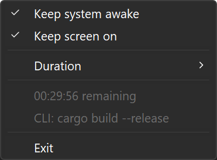

<div align="center">


# caffeinate

**Keep Windows awake. From the tray, or from the command line.**

[](LICENSE)
[](#)
[](https://www.rust-lang.org)

</div>

---

No power plan is changed and no key presses are faked. It holds the documented
[`SetThreadExecutionState`][stes] request, the same mechanism video players and
installers use, and lets go the moment it exits.

Two programs ship together:

| | |
|---|---|
| **`caffeinate`** | a command line tool, in the spirit of macOS `caffeinate` |
| **`caffeinate-tray`** | a tray icon with a menu, for when you are not in a terminal |

[stes]: https://learn.microsoft.com/en-us/windows/win32/api/winbase/nf-winbase-setthreadexecutionstate

## The command line

Put it in front of anything that takes a while:

```console
$ caffeinate cargo build --release
```

The machine stays awake for exactly as long as the build runs, then stops. The
build's exit code passes straight through, so dropping `caffeinate` in front of
a command never changes what a script sees.

```console
$ caffeinate -t 2h              # hold for two hours, then stop
$ caffeinate                     # hold until Ctrl-C
$ caffeinate -d npm run dev      # keep the screen on as well
$ caffeinate -- cargo build -d   # -- when the command has flags of its own
```

```
OPTIONS
    -d, --display          Also keep the screen on. The default holds off
                           system sleep only, so the display can still blank.
    -t, --time <duration>  Hold for a period, then exit. A bare number is
                           seconds, or use a suffix: 90, 30s, 45m, 2h
    -h, --help             Show this help
```

`-t` and a command cannot be combined. macOS quietly ignores `-t` in that case;
this refuses instead, because a silently dropped time limit is worse than an
error.

It stays silent unless something goes wrong, so it composes cleanly in scripts.

## The tray



- The two switches are independent, and hold one flag each:
  `ES_SYSTEM_REQUIRED` and `ES_DISPLAY_REQUIRED`. While a big download runs you
  can keep the system awake and still let the screen turn off.
- When the countdown expires both switches turn off and the duration resets.
- Choosing a duration while both switches are off only records the choice; the
  clock starts when a switch goes on.
- A second switch turned on mid countdown does not restart it. A different
  duration does.
- Every launch starts off. Nothing is remembered, nothing is added to startup,
  nothing is written to the registry.
- A second copy exits immediately, so there is never a duplicate icon.

While `caffeinate` is holding the machine awake, the tray says so: the icon
lights up and a row appears naming the command. The two checkmarks stay put,
because they report what **you** chose and a CLI hold is somebody else's
business.

The announcement happens once, when the hold starts, so a tray launched *after*
a hold is already running will not show it. The hold itself is unaffected: the
CLI owns the power request either way, and the display is the only thing that
misses out.

The interface follows the system display language: Chinese on a Chinese
Windows, English everywhere else. That is not only taste. A Win32 menu takes
its font from the system-wide `lfMenuFont`, which on an English Windows is
Segoe UI, and Segoe UI has no CJK glyphs, so Chinese falls through GDI font
linking into a Japanese face that looks poor at menu sizes.

## Install

### Scoop

```console
$ scoop bucket add zet235 https://github.com/zet235/scoop-bucket
$ scoop install caffeinate
```

That puts `caffeinate` on your `PATH` and gives the tray app a Start menu
entry. Later versions arrive with `scoop update caffeinate`.

### By hand

Grab the latest [release][releases] and unzip it anywhere. Two files, no
installer, no runtime, nothing written to the registry.

Put `caffeinate.exe` somewhere on `PATH` and run `caffeinate-tray.exe` when you
want the icon.

[releases]: https://github.com/zet235/caffeinate/releases

## Build

A Rust toolchain and mingw. Visual Studio is not required.

```console
$ scoop install main/rustup-gnu main/mingw
$ cargo build --release
```

mingw is not optional: on the gnu target `windows-sys` shells out to
`dlltool.exe`, and `winresource` needs `windres.exe`.

The artwork is generated, not drawn by hand:

```console
$ python tools/gen_icons.py
```

Pure Python, no dependencies. Change the two RGB values in `main()` for
different colours.

## Does it actually work?

With an **administrator** terminal:

```console
$ powercfg /requests
```

While something is held, the `SYSTEM:` and `DISPLAY:` sections name the process
holding it, and return to `None` afterwards.

`powercfg` needs elevation and there is no unprivileged equivalent, because the
request is bound to a thread inside the holding process and nothing outside it
can read that back. Without an administrator terminal the only check available
is the behavioural one: leave the machine idle past its sleep timeout and see
that it stays up.

## Notes for anyone changing this

Three things here are easy to get wrong and hard to notice afterwards. Each one
fails silently.

- **`ES_CONTINUOUS` on every call.** Without it `SetThreadExecutionState`
  resets the idle timer once instead of holding the state, so everything looks
  fine and the machine sleeps anyway a few minutes later.
- **The countdown ticks from a `TIMERPROC`, not a `WM_TIMER` the message loop
  reads.** While the tray menu is open Windows runs its own modal message loop,
  which drains the queue: a bare `WM_TIMER` is dispatched there and never
  reaches our `GetMessageW`, so the clock would stop for as long as the menu
  stayed open and the machine would sit awake past its deadline. A `TIMERPROC`
  is called *by* `DispatchMessageW`, so the modal loop runs it too. No unit
  test catches this either way, because the bug is in the wiring.
- **The request is bound to the calling thread**, which is why neither program
  starts a background thread. The tray counts down inside its message loop; the
  CLI stays on its main thread for the length of the hold.

That last point is also why the CLI holds its own request rather than asking
the tray to. If the tray is not running, crashes, or is killed, the CLI is
still correct. What crosses between them is only enough for the tray to
*display* the hold, and a `WM_COPYDATA` message is all it takes. A CLI killed
outright never sends its release, so the tray keeps a `SYNCHRONIZE` handle to
the announcing process and drops the row within a second of it exiting.

## Limitations

Some Modern Standby (S0ix) machines, and corporate group policy, can still
force the display off or the machine to sleep. That is system level behaviour
no user mode program can override.

## License

MIT. See [LICENSE](LICENSE).
